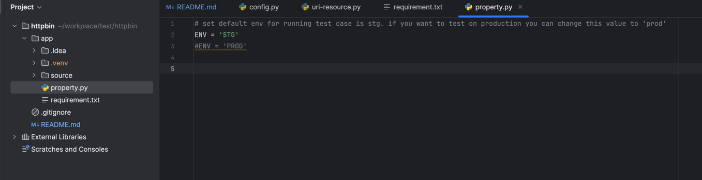

# httpbin

## How to run test cases
### 1. Clone project 
Use this command to clone project to local: git clone https://github.com/dinhn263/httpbin.git

### 2. Install library before run test case 
Open terminal and go to app folder where contains the file "requirement.txt" and run command
pip3 install -r requirement.txt

### 3. Run test case 
At the same path where contains the file "requiment.txt", run command to run test
robot --outputdir report source/test/testsuites/api/*

## Data testing and environment
Suppose we have 2 environment test: staging (STG) and production (PRD)
if you want to run the test on staging env, please modify the value of variable ENV located at /ap/property.py
 + set to "STG" if you want to run the test on staging env
 + set to "PROD" if you want to run the test on production env

Suppose we have different data testing ex: username, password in different environment, you can edit them at /ap/source/test/resource/config.py

